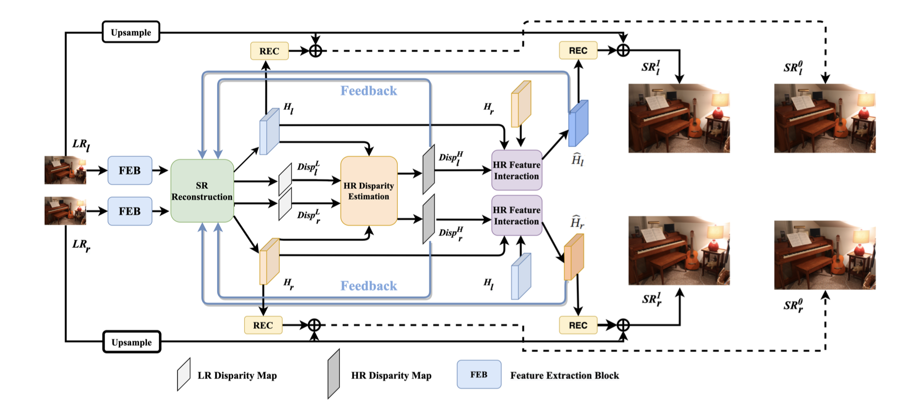
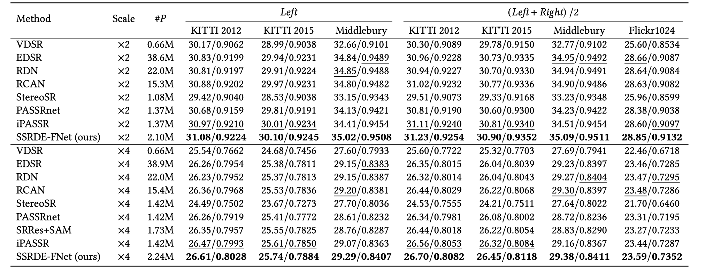
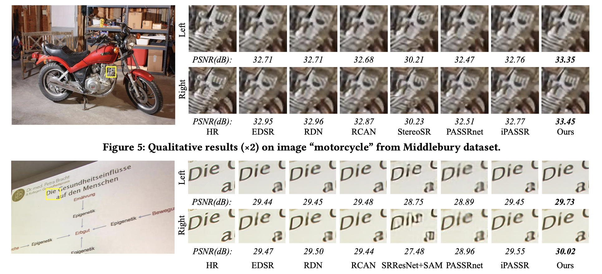

# SSRDEFNet_PyTorch
### This repository is an official PyTorch implementation of the paper "Feedback Network for Mutually Boosted Stereo Image Super-Resolution and Disparity Estimation". (ACM MM 2021)

### Paper can be download from <a href="https://dl.acm.org/doi/pdf/10.1145/3474085.3475356?casa_token=xxiBdhWjzZsAAAAA:OpOd1w27KNFGuia_vmshxrvnsQklEjNYIa7k7Qv8gcF4DJ25aEmAWJmDlotT0VmYzQpeuvsYCRImSw">SSRDE-FNet</a> 

Under stereo settings, the problem of image super-resolution (SR) and disparity estimation are interrelated that the result of each problem could help to solve the other. The effective exploitation of correspondence between different views facilitates the SR performance, while the high-resolution (HR) features with richer details benefit the correspondence estimation. According to this motivation, we propose a Stereo Super-Resolution and Disparity Estimation Feedback Network (SSRDE-FNet), which simultaneously handles the stereo image super-resolution and disparity estimation in a unified framework and interact them with each other to further improve their performance. Specifically, the SSRDE-FNet is composed of two dual recursive sub-networks for left and right views. Besides the cross-view information exploitation in the low-resolution (LR) space, HR representations produced by the SR process are utilized to perform HR disparity estimation with higher accuracy, through which the HR features can be aggregated to generate a finer SR result. Afterward, the proposed HR Disparity Information Feedback (HRDIF) mechanism delivers information carried by HR disparity back to previous layers to further refine the SR image reconstruction. Extensive experiments demonstrate the effectiveness and advancement of SSRDE-FNet.




The pre-trained model for x4 SR is in ./checkpoints/SSRDEF_x4SR_epoch80.pth.tar</a> 

All reconstructed images for x4 SR can be download from <a href="https://www.jianguoyun.com/p/Db8LmLwQ19ySBxjA-rEE">SSRDEFNet_Results</a> 

All test datasets (Preprocessed HR images) can be download from <a href="https://www.jianguoyun.com/p/DTpsWpYQ19ySBxjH_bEE">SSRDEFNet_Test</a> 

Extract the dataset and put them into the ./data/test/.


## Prerequisites:
1. Python 3.6
2. PyTorch >= 0.4.0
3. numpy
4. skimage
5. imageio
6. matplotlib


## Dataset

We used Flickr1024 and Middlebury dataset to train our model, which is exactly the same as <a href="https://github.com/YingqianWang/iPASSR">iPASSR</a>. Please refer to their homepage  and download the dataset as their guidance.

Extract the dataset and put them into the ./data/train/.

##Training

```python

python train.py --scale_factor 4

```

##Testing

```python

# Testing stereo sr performance

python test_sr.py

# Testing disparity estimation performance

python test_disp.py

```

##Performance

<p align="center">
   
</p>

<p align="center">
   
</p>


```
@inproceedings{dai2021feedback,
  title={Feedback Network for Mutually Boosted Stereo Image Super-Resolution and Disparity Estimation},
  author={Dai, Qinyan and Li, Juncheng and Yi, Qiaosi and Fang, Faming and Zhang, Guixu},
  booktitle={Proceedings of the 29th ACM International Conference on Multimedia},
  pages={1985--1993},
  year={2021}
}
```

This implementation is for non-commercial research use only. 
If you find this code useful in your research, please cite the above papers.